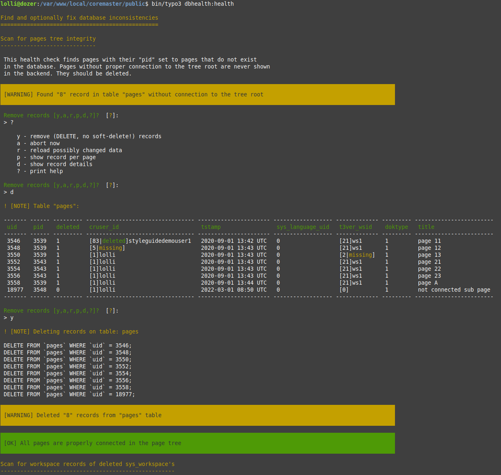

TYPO3 DB health
===============

# Mission

The mission of this extension is to find database inconsistencies that may
have been introduced in a living TYPO3 instance over time, and to fix them.

As example, when a page tree is deleted by an editor, it sometimes happens
that most pages are properly set to deleted, but some pages are missed, or a
content element on one page is not deleted. This leads to orphan pages or
content elements in the database.

There can be many reasons to end up with invalid database state like the above:
TYPO3 in general has no referential integrity constrains on database tables,
inconsistencies can be triggered by a dying PHP process, a lost DB connection, a
core bug, a buggy extension, a broken deployment, and more. Long living active
instances that were upgraded through multiple major core versions tend to end up
with something that isn't quite right anymore.

Such inconsistencies can lead to further issues. For instance if a page
is copied that has an orphaned localized record, the system tends to mess up
localizations of the copied page, too. Editors then stumble and TYPO3 agencies
have to do time-consuming debug sessions to find out what went wrong.

This extension provides a CLI command that tries to find various such inconsistencies
and gives admins options to fix them.


# Alternatives

We're not aware of other open extensions that try to achieve the same in a similar
systematic way. The core `lowlevel` extension comes with a couple of commands that
try to clean up various DB state, but their codebase is rather rotten and hard to
maintain.

This extension is not a substitution of `lowlevel` commands (yet?), it's more an
incubator to see if a certain strategy dealing with inconsistencies actually works
out in projects. It will grow over time. Maybe it ends up in the core, or the core
refers to this extension as "maintenance" extensions in the future. We'll see.


# Strategy

The strategy of this command is to check for single things one-at-a-time and to
fix them before going to the next check. Updates and deletes of not-ok records
are done with low-level database queries directly, not using the DataHandler.

Single checks are carefully crafted and functional tested and the order in which
they are executed is important. It can happen that a single check is run multiple
times in the chain.

Single checks rather try to avoid memory consumption at the cost of more queries being
executed. Queries are often performed as prepared statements to re-use them often
in a single check. Statements are properly closed when a single check finished,
effectively using the PHP garbage collection. All-in-all, this command should be
relatively quick even for big-sized instances, but it will hammer the database a lot.


# Installation

## Composer

You probably want to install this as `--dev` dependency. The extension currently
supports TYPO3 v11 and TYPO3 v12:

```
$ composer require --dev lolli/dbhealth
```

## TYPO3 Extension Repository

[No upload yet] For non-composer projects, the extension is available in TER as extension key
`dbhealth` and can be installed using the extension manager.


# Preparation

The nature of the CLI command is to perform destructive database operations on your
instance. As such, a few things should be kept in mind:

* [!!!] 💣 **Create a fresh database backup dump before using the CLI interface.**
  Ensure the recovery strategy works. Both the extension and the user can potentially
  get something wrong. We are dealing with low level database stuff here after all,
  so things can potentially go south rather quickly.

* [!!!] 💣 Make sure the database analyzer is happy and needs no new fields or tables.
  There will be a check in the future to verify this early, but for now, **do not use
  the CLI interface with incomplete database analyzer**.

* It's probably not a bad idea to look at not-yet done upgrade wizards before using
  the extensions CLI command.

* [!!!] Run the reference index updater when this command finished! It is very likely
  it will update something. A clean reference index becomes more and more important
  with younger core versions. Reminder: command `bin/typo3 referenceindex:update`.


# Usage

```
$ bin/typo3 dbhealth:health
```

The interface looks like this:



The main command is a chain of single checks. They are done one by one. Affected
record details can be shown on a per-page and a per-record basis to give a quick
overview. The interface allows deleting or updating of affected records, depending
on the type of the check.

The default interactive mode will never perform updates automatically and
always asks the user for actions. When pressing 's' (simulate/show), the queries
that *would* be performed are shown, when pressing 'e' (execute), the queries
are actually executed.

In the example above, eight pages are found that have no connection to the
tree-root anymore. A help is selected, then an overview to show more record
details. Finally, the records are deleted and the next check is called. The
delete queries are shown, which can become handy if those should be executed
manually on a different server.


# Options

The CLI comes with a couple of options. The default mode is "interactive",
prompting for user input after each failed check.

* Help overview:
  ```
  $ bin/typo3 dbhealth:health -h
  ```
  Left to the reader to find out what is done here :P

* Interactive mode: `--mode interactive` or `-m interactive` or option not given:
  ```
  $ bin/typo3 dbhealth:health -m interactive
  ```
  The default mode: Perform checks one-by-one and have an interactive interface
  to see affected record details, show pages with affected records, simulate
  performed queries, reload check and ultimately execute queries.

* Check mode: `--mode check` or `-m check`:
  ```
  $ bin/typo3 dbhealth:health -m check
  ```
  Run all checks but don't perform any DB changes. Returns 0 (zero) if some checks
  found something and non-zero if something was found by any check. Useful to run
  as cron job to see if check "go red" over time after everything has been fixed once.

* Execute mode: `--mode execute` or `-m execute`:
  ```
  $ bin/typo3 dbhealth:health -m execute
  ```
  Blindly execute all checks without further questions! Destructive auto-operation if
  you trust the command enough, which you shouldn't ;-) Did you create a DB backup before?

* Log execute queries to file: `--file` or `-f`:
  ```
  $ bin/typo3 dbhealth:health -f /tmp/foo.sql
  ```
  ```
  $ bin/typo3 dbhealth:health -f /tmp/dbhealth-changes-my-instance-`date +%Y-%m-%d-%H-%M-%S`.sql
  ```
  Log all data changing queries to a file. The argument must be an *absolute file name*.
  **Never put such a file into the public web folder of your instance**. This is available in
  "interactive" and "execute" mode. Data changing queries are not only displayed, but also
  logged to a file. This can be useful if the command has been executed on a staging system
  using a current live database image: The queries can be reviewed again and then executed
  on a live instance using something like `mysql my_database < file.sql` or similar for other
  DBMS.


# Existing health checks

Single tests are described in details when running the CLI command. Rough overview:

* General page tree integrity checks
* Various FAL related sys_file_reference and friends checks
* Various language handling related checks
* Tons of workspace related checks


# FAQ

* Will the functionality be made available in a backend GUI?
  > No. CLI is the only sane way for this kind of things.

* Will support for TYPO3 v10 or other older core versions added?
  > No. TYPO3 v11 had quite a few DB changes, and it is not planned to implement
  > a v10 backwards compatible layer.
